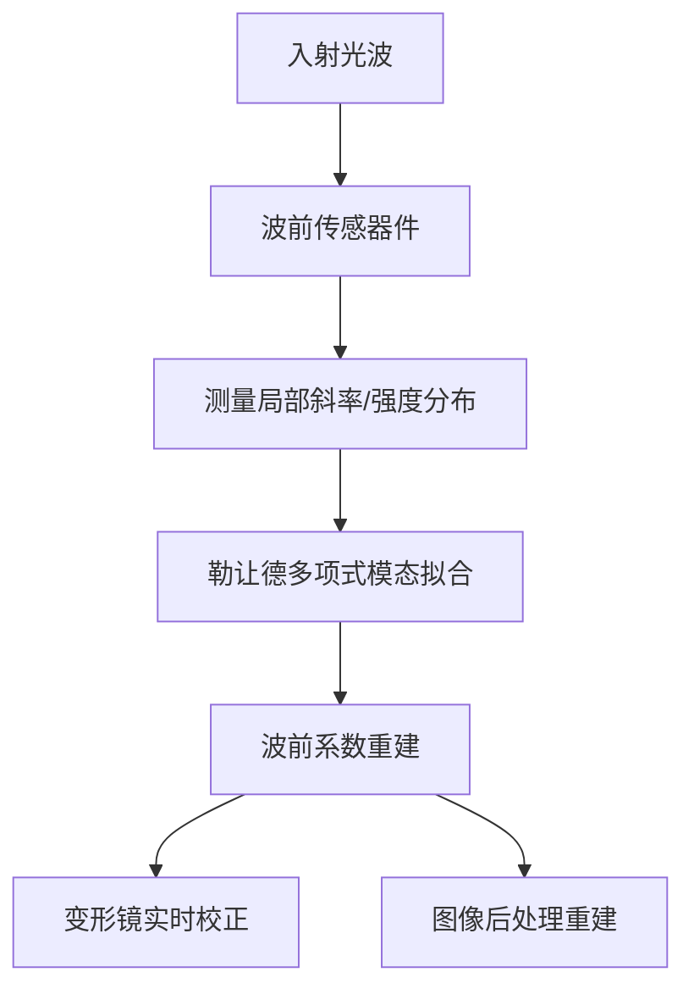

# 基于勒让德多项式的波前传感器

## 📖 概述

基于勒让德多项式的波前传感器是自适应光学与波前探测领域的一种技术方案。该类传感器部署在相应的光学设备上，能够检测光的畸变情况与成像质量，并通过特定的重建方法恢复光学成像。

---

## 🧩 核心原理

波前传感器的作用，是测量入射光波相对于理想波前（平面波或球面波）的偏离程度——这种偏离即为"畸变"，通常由大气湍流、光学系统像差或光学元件缺陷等因素引起。

为了对畸变进行紧凑、定量的描述，通常将波前畸变展开为一组**基函数的加权和**，而不是直接使用原始像素数据。

**勒让德多项式（Legendre Polynomials）** 作为基函数（区别于更常用的泽尼克多项式 Zernike Polynomials），在特定光瞳几何形状下具有优势——尤其适用于**矩形或方形孔径**的系统。泽尼克多项式定义在圆形域上，难以自然适配矩形孔径；而勒让德多项式在直角坐标域（矩形域）上具有正交性，能够为此类系统提供更稳定、更精确的拟合结果。

---

## ⚙️ 典型工作流程

1. **探测器件**：常见方案包括夏克-哈特曼传感器（Shack-Hartmann，通过微透镜阵列生成焦斑阵列，焦斑位移反映局部波前斜率）或金字塔波前传感器（Pyramid Wavefront Sensor）。

2. **斜率/强度测量**：探测器件测量畸变波前的局部梯度或强度分布模式。

3. **波前重建**：将测得的斜率或强度数据，拟合为一组加权的勒让德多项式项之和，通常采用最小二乘法或模态拟合方法，求解能够最佳重建完整二维波前相位图的系数。

4. **校正/重建**：所得系数可用于：
   - 驱动变形镜进行**实时波前校正**；
   - 或纯粹用于**计算层面的图像重建**（事后处理），例如结合估计出的点扩散函数（PSF）进行图像反卷积，还原出光学系统"本应"呈现的成像效果。

---

## 🔍 为何选用勒让德多项式而非泽尼克多项式

| 对比维度         | 勒让德多项式             | 泽尼克多项式                   |
| ---------------- | ------------------------ | ------------------------------ |
| 适用孔径形状     | 矩形 / 方形孔径          | 圆形孔径                       |
| 正交域           | 直角坐标域               | 极坐标（单位圆）域             |
| 非圆形孔径下表现 | 拟合精度高，模态间串扰小 | 存在几何失配，易产生模态间串扰 |
| 计算特性         | 可分离、正交，拟合效率高 | 可分离、正交，但仅限圆形域高效 |

**优势总结：**

✅ 对方形/矩形光瞳有更好的数值条件（如部分分块式望远镜孔径、某些激光或工业光学系统）

✅ 避免了非圆形孔径下的几何失配问题，减少模态间串扰

✅ 保持可分离与正交特性，系数拟合计算效率高

---

## 🎯 应用领域

- 天文观测（自适应光学望远镜系统）
- 眼科检查（人眼像差测量与视觉矫正）
- 激光系统（激光光束质量检测与校正）
- 半导体计量（光刻系统波前检测）

---

## 📌 小结

基于勒让德多项式的波前传感器，通过在矩形/方形孔径下更优的正交基函数拟合，实现对光学系统畸变的精确探测与量化描述，并结合变形镜校正或图像后处理算法，完成对成像质量的实时校正或事后重建，是自适应光学领域中一种针对非圆形孔径场景的重要技术路线。
